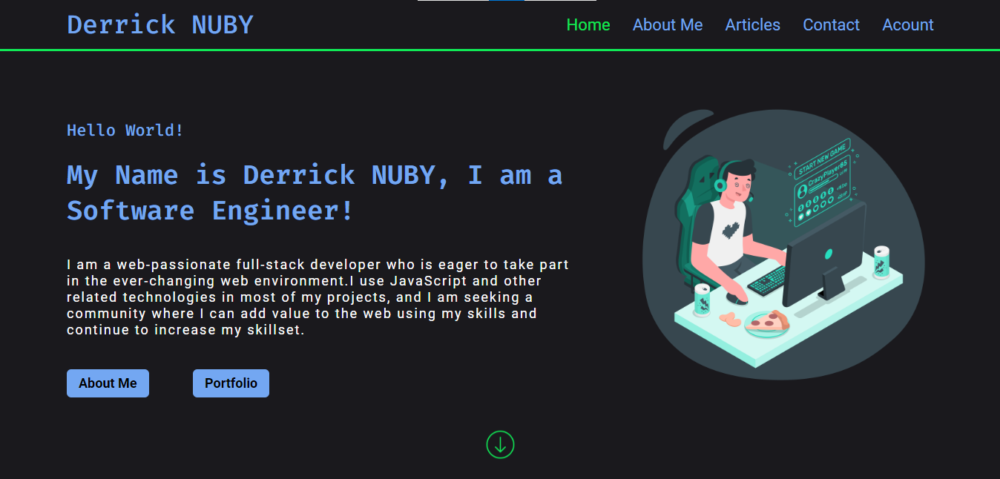
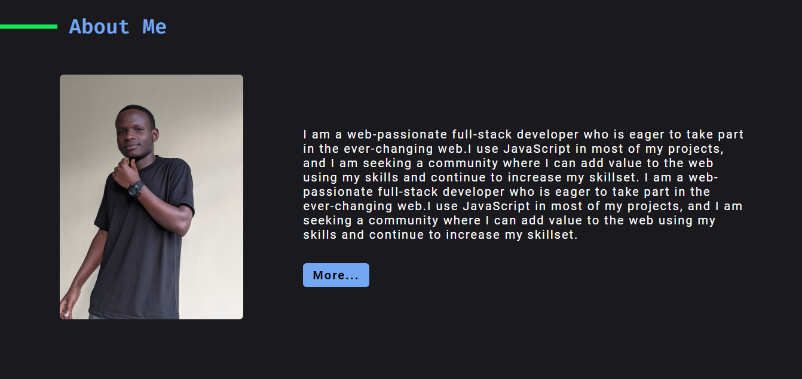

>       

# My Personal Portfolio Website

 
 

<h1 align="center">
<a href="https://derrick-nuby.github.io/My-Brand/" TARGET="_blank" rel="noreferrer noopener"> Visit Portfolio Website</a> </h1>
 

## Why Portfolio Website

A portfolio website is how users will find you when they want to connect with you, it is where potential employers can see your skill and check your projects.

It is also a place to write specifically for me i will be writing aout technology.... And much more.

## Expected Time Of Completion

ongoing

## Contributing

Pull requests are welcome. For major changes, please open an issue first
to discuss what you would like to change.

Please make sure to update tests as appropriate.

## end.....
